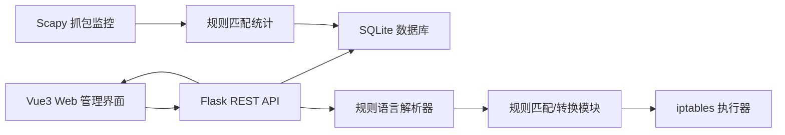

# 简易防火墙课程设计 - 系统设计文档

日期：2026-07-04

## 1. 背景与目标

本项目用于完成“简易防火墙设计”课程设计。系统在 Linux 主机上运行，提供 Web 管理界面，实现规则配置、规则解析、真实防火墙规则应用、抓包监控、日志审计和运行结果图表展示。

目标交付为完整可运行项目：Vue3 前端、Python Flask 后端、SQLite 数据库、Scapy 抓包监控、iptables 规则应用，以及课程设计所需文档。

## 2. 已确认范围

### 2.1 运行环境

- 目标环境：Linux 主机。
- 防火墙控制范围：本机入站和出站流量。
- iptables 链路：`INPUT` 与 `OUTPUT`。
- 程序运行权限：应用 iptables 与抓包时需要 root 或 sudo 权限。

### 2.2 交付范围

交付完整可运行项目，包括：

- Vue3 + HTML + CSS + JavaScript 前端管理界面。
- Python3 + Flask REST API 后端。
- 自定义防火墙规则语言及解析器。
- SQLite 规则、日志、配置和统计数据存储。
- Scapy 抓包监控与协议解析。
- subprocess 调用 iptables 完成真实拦截和放行规则应用。
- README、功能目标分解表、课程设计报告、规则语言说明。

## 3. 总体架构

系统采用前后端分离架构。



核心模块：

- 前端：页面导航、规则管理、主页统计、抓包监控、日志审计、系统设置。
- 后端 API：规则增删改查、DSL 解析、日志查询、状态统计、系统配置管理。
- 规则解析器：将自定义规则语言转换为结构化规则对象。
- iptables 执行器：将启用规则转换为本项目管理的 iptables 规则。
- Scapy 监控器：监听网卡流量，提取 IP、端口、协议、包长度等信息。
- SQLite：保存规则、待更新队列、流量日志、系统日志和系统配置。

## 4. 前端设计

前端采用左侧导航栏与右侧内容区布局，不把全部功能堆在同一页面。主页负责数量分析与总体概览，各功能模块独立成页。

前端路由：

```txt
/          首页概览
/rules     规则管理
/monitor   抓包监控
/logs      日志审计
/settings  系统设置
```

### 4.1 首页概览

首页用于展示系统运行状态和数量分析：

- 拦截次数。
- 放行次数。
- 活跃连接数。
- 启用规则数。
- ECharts 实时网络流量折线图。
- ECharts 协议分布饼图。
- 最近日志和系统状态摘要。

### 4.2 规则管理

规则管理页面提供：

- 规则新增、修改、删除、启用、禁用。
- 表单式规则配置：动作、方向、协议、源 IP、目标 IP、源端口、目标端口。
- DSL 文本输入与解析。
- 更新模式设置：立即更新、按时间更新、按数量更新。
- 当前规则列表与应用状态展示。

### 4.3 抓包监控

抓包监控页面提供：

- Scapy 抓包启动和停止。
- 网卡选择。
- 抓包运行状态。
- 实时数据包列表。
- 流量趋势、协议统计、活跃连接展示。

### 4.4 日志审计

日志审计页面提供：

- 拦截与放行日志查询。
- 系统运行日志查询。
- 按时间、动作、协议、IP 过滤。
- 分页展示。
- CSV 导出。

### 4.5 系统设置

系统设置页面提供：

- 网卡名称配置。
- iptables 应用开关。
- Scapy 抓包开关。
- 定时更新间隔配置。
- 数量更新阈值配置。
- 清空日志。
- 重置本项目防火墙规则。

## 5. 规则语言 DSL 设计

规则语言采用一行一条规则，支持动作、方向、协议、IP 和端口配置。

示例：

```txt
ALLOW IN  TCP FROM 192.168.1.10 TO ANY SPORT ANY DPORT 80
DENY  OUT UDP FROM ANY TO 8.8.8.8 SPORT ANY DPORT 53
DENY  IN  ICMP FROM 10.0.0.5 TO ANY
ALLOW IN  TCP FROM ANY TO ANY SPORT ANY DPORT 22
```

字段含义：

- `ALLOW | DENY`：放行或拦截。
- `IN | OUT`：入站或出站，对应 `iptables INPUT/OUTPUT`。
- `TCP | UDP | ICMP | ANY`：协议类型。
- `FROM`：源 IP，支持具体 IP、CIDR、`ANY`。
- `TO`：目标 IP，支持具体 IP、CIDR、`ANY`。
- `SPORT`：源端口，支持数字、范围、`ANY`；ICMP 可省略。
- `DPORT`：目标端口，支持数字、范围、`ANY`；ICMP 可省略。

解析器输出统一规则对象，例如：

```json
{
  "action": "DENY",
  "direction": "OUT",
  "protocol": "UDP",
  "src_ip": "ANY",
  "dst_ip": "8.8.8.8",
  "src_port": "ANY",
  "dst_port": "53"
}
```

解析器需要校验：

- 动作是否合法。
- 方向是否合法。
- 协议是否合法。
- IP 或 CIDR 格式是否合法。
- 端口是否为数字、范围或 `ANY`。
- ICMP 规则是否错误填写端口。

## 6. 更新机制设计

系统支持三种规则更新方式。

### 6.1 立即更新

用户保存规则后：

1. 后端解析并校验规则。
2. 写入 SQLite。
3. 若规则启用，立即刷新本项目管理的 iptables 规则。
4. 写入系统日志。

### 6.2 按时间更新

用户设置“每 N 秒应用一次规则变更”。新增、修改、删除先进入待更新队列，后台线程按时间间隔批量应用。

### 6.3 按数量更新

用户设置“累计 N 条变更后应用”。待更新队列达到阈值后，后端批量刷新 iptables 规则。

### 6.4 iptables 应用策略

为避免逐条插入和删除造成规则顺序混乱，应用规则时采用重建策略：

1. 清理本项目创建的 iptables 链或规则标记。
2. 查询当前启用规则。
3. 按优先级排序。
4. 重新生成并执行 iptables 命令。
5. 记录执行结果和异常信息。

## 7. 后端 API 设计

Flask 提供 REST API：

```txt
GET    /api/health
GET    /api/stats
GET    /api/rules
POST   /api/rules
PUT    /api/rules/<id>
DELETE /api/rules/<id>
POST   /api/rules/parse
POST   /api/rules/apply
GET    /api/logs
GET    /api/traffic/recent
GET    /api/settings
PUT    /api/settings
POST   /api/sniffer/start
POST   /api/sniffer/stop
```

主要数据流：

- 前端新增规则 → `POST /api/rules` → 后端解析校验 → SQLite 保存 → 根据更新模式决定是否调用 iptables。
- Scapy 抓包 → 提取五元组、协议、长度 → 规则匹配统计 → SQLite 写入流量和日志。
- 前端定时轮询 `/api/stats` 与 `/api/traffic/recent` → ECharts 动态刷新。
- 日志页面调用 `/api/logs` 分页查询。

## 8. 数据库设计

数据库使用 SQLite。

### 8.1 `rules`

防火墙规则表。

```txt
id
name
action
direction
protocol
src_ip
dst_ip
src_port
dst_port
enabled
priority
dsl_text
created_at
updated_at
```

### 8.2 `rule_updates`

待应用更新队列表。

```txt
id
rule_id
operation       CREATE / UPDATE / DELETE
status          PENDING / APPLIED / FAILED
message
created_at
applied_at
```

### 8.3 `traffic_logs`

数据包与规则匹配日志表。

```txt
id
timestamp
src_ip
dst_ip
src_port
dst_port
protocol
direction
action
rule_id
packet_len
reason
```

### 8.4 `system_logs`

系统运行日志表。

```txt
id
timestamp
level
module
message
```

### 8.5 `settings`

系统配置表。

```txt
key
value
description
updated_at
```

## 9. 测试方案

### 9.1 规则配置测试

- 新增规则：禁止访问指定 IP 或端口。
- 修改规则：把 `DENY` 改为 `ALLOW`。
- 删除规则：确认规则从 iptables 中移除。
- DSL 输入：输入合法和非法规则，验证解析结果。

### 9.2 iptables 拦截测试

测试规则示例：

```txt
DENY OUT UDP FROM ANY TO 8.8.8.8 SPORT ANY DPORT 53
DENY IN TCP FROM ANY TO ANY SPORT ANY DPORT 22
```

测试工具：

- `ping`
- `curl`
- `nc`
- `dig`
- `iptables -S`

### 9.3 抓包监控测试

- 启动 Scapy 抓包。
- 发起网络请求。
- 检查前端流量折线图变化。
- 检查协议分布饼图变化。
- 检查活跃连接列表变化。

### 9.4 日志审计测试

- 验证拦截和放行日志写入 SQLite。
- 按 IP、协议、动作过滤日志。
- 分页查询日志。
- 导出 CSV。

### 9.5 更新机制测试

- 立即更新：保存规则后立即生效。
- 时间更新：设置间隔后批量应用。
- 数量更新：累计指定条数后批量应用。

## 10. 文档交付

项目最终文档结构：

```txt
README.md
docs/功能目标分解表.md
docs/课程设计报告.md
docs/规则语言说明.md
backend/
frontend/
```

课程设计报告包含：

- 选题背景与目标。
- 系统需求分析。
- 总体架构设计。
- 规则语言设计。
- 数据库设计。
- 核心模块实现。
- 系统测试与结果分析。
- 运行截图与图表展示。
- 总结。

## 11. 成功标准

项目完成时应满足：

- Vue3 前端可运行，包含首页、规则管理、抓包监控、日志审计和系统设置页面。
- Flask 后端可运行并提供 REST API。
- 自定义 DSL 可以解析、校验并转换成结构化规则。
- 规则可新增、修改、删除、启用、禁用。
- Linux 上启用规则能应用到 iptables 的 INPUT/OUTPUT。
- Scapy 能监听网络流量并生成统计数据。
- ECharts 能动态展示流量趋势和协议分布。
- SQLite 能保存规则、日志、配置和运行数据。
- 项目代码有必要注释，每个函数说明作用、参数和返回值。
- 提供功能目标分解表和课程设计报告。

## 12. 关键假设与约束

- Linux 主机允许安装 Python、Node.js、iptables、Scapy 相关依赖。
- 应用真实防火墙规则需要 root 或 sudo 权限。
- 本项目只管理自己创建的防火墙规则，不修改系统已有规则。
- 本项目优先支持 IPv4。
- 本项目以课程演示和实验验证为目标，不作为生产级防火墙使用。
